# ChatGPT2API 部署教程：反代 Image 2，免费搭建图片生成 API

ChatGPT2API 通过反代 ChatGPT 官网的 Image 2 绘图模型，将其封装成兼容 API 接口，方便第三方应用直接调用。

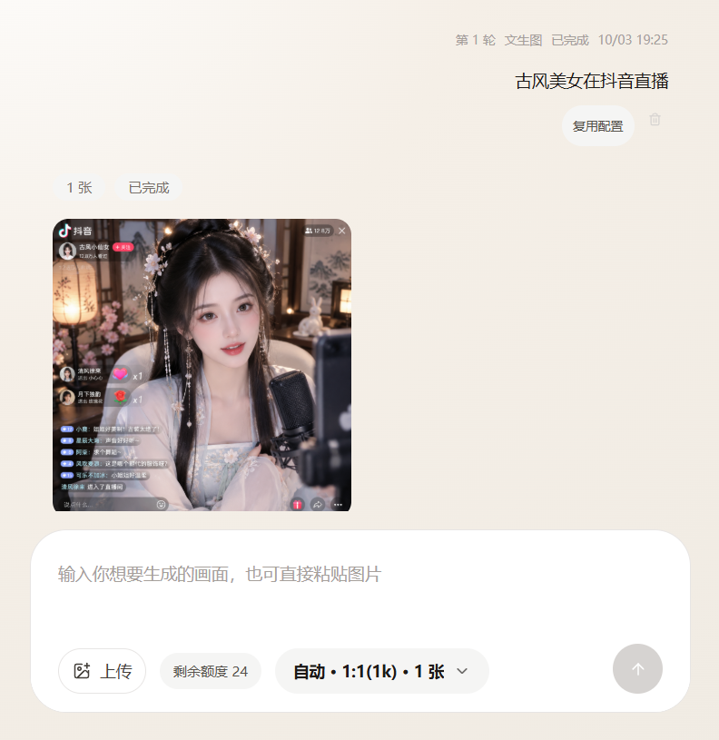

## 服务器推荐

推荐服务器部署，不要选择国内地区，选择 Linux 版本 Docker 上手快。

腾讯云首尔/雅加达/曼谷地区价格是 199 元一年，2 核 4G 30M 带宽，60GB SSD 盘 1.5T 月流量，推荐首尔地区，系统选 Ubuntu 24。

购买地址：<https://curl.qcloud.com/oyWDLkRJ>

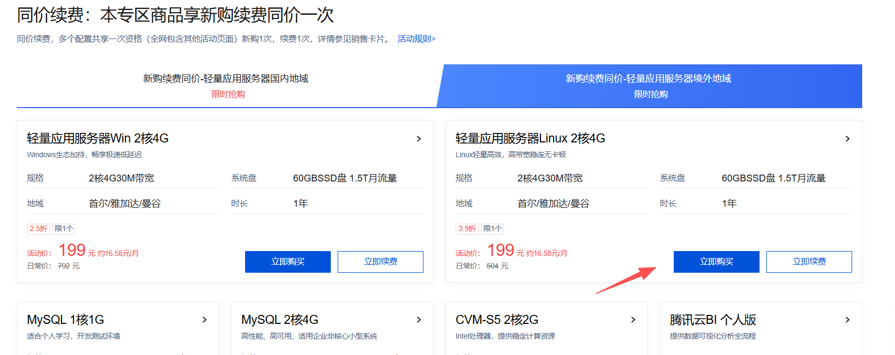

## 教程

**1. 登录服务器，Ubuntu 24 安装 Docker**

```bash
sudo apt update
sudo apt install -y ca-certificates curl gnupg
sudo install -m 0755 -d /etc/apt/keyrings
curl -fsSL https://download.docker.com/linux/ubuntu/gpg | sudo gpg --dearmor -o /etc/apt/keyrings/docker.gpg
sudo chmod a+r /etc/apt/keyrings/docker.gpg
echo \
"deb [arch=$(dpkg --print-architecture) signed-by=/etc/apt/keyrings/docker.gpg] https://download.docker.com/linux/ubuntu \
$(. /etc/os-release && echo "$VERSION_CODENAME") stable" | \
sudo tee /etc/apt/sources.list.d/docker.list > /dev/null
sudo apt update
sudo apt install -y docker-ce docker-ce-cli containerd.io docker-buildx-plugin docker-compose-plugin
sudo docker run hello-world
```

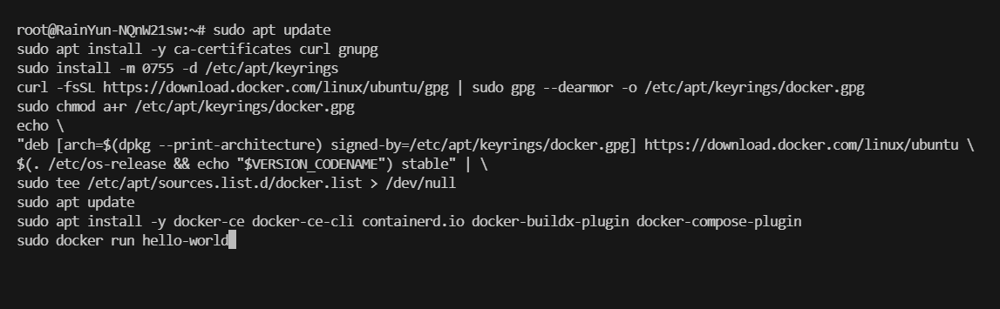

**2. Docker 运行项目**

```bash
git clone https://github.com/basketikun/chatgpt2api.git
cd chatgpt2api
docker compose up -d
```

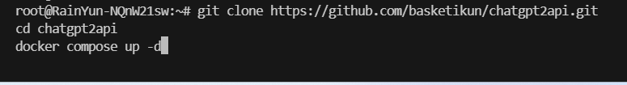

**3. 浏览器打开以下地址**

一定是你的服务器 IP + 端口号，需要提前打开防火墙放通端口号 3000。

```
http://服务器IP:3000
```

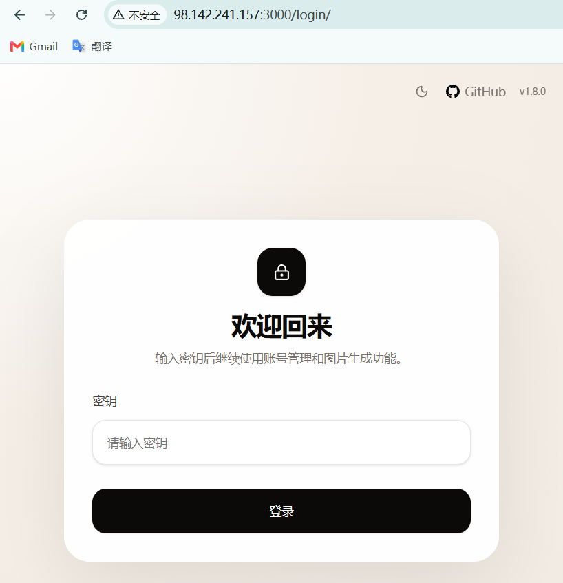

**4. 输入默认密钥**

教程未修改密钥，大家记得修改密钥。

```
chatgpt2api
```

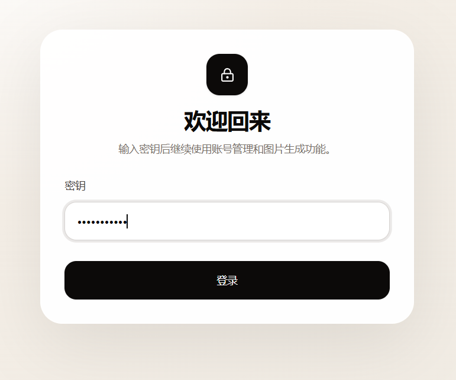

**5. 在号池管理找到导入**

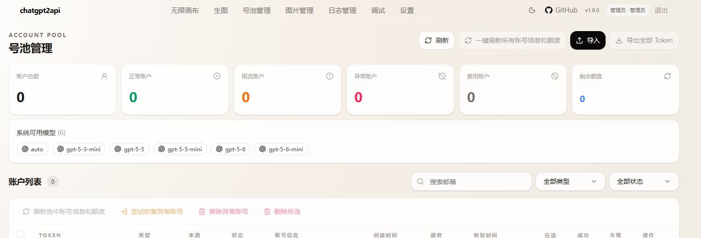

**6. 选择 OAuth 登录**

可前提在浏览器登录 GPT 账号。

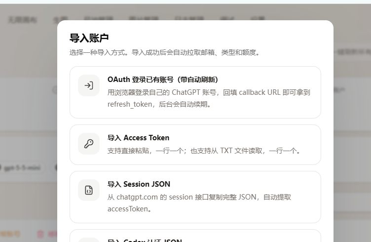

**7. 复制顶部的 URL 地址**

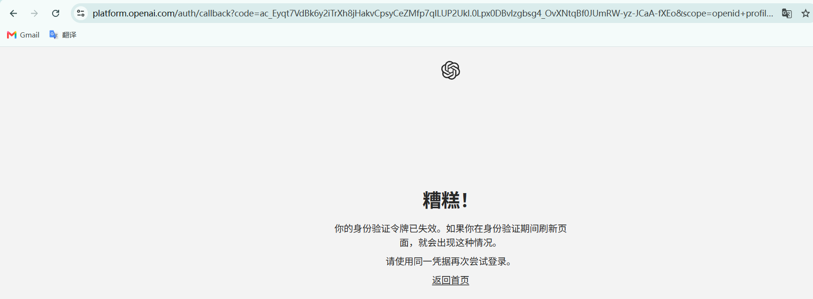

**8. 填入，点击完成导入**

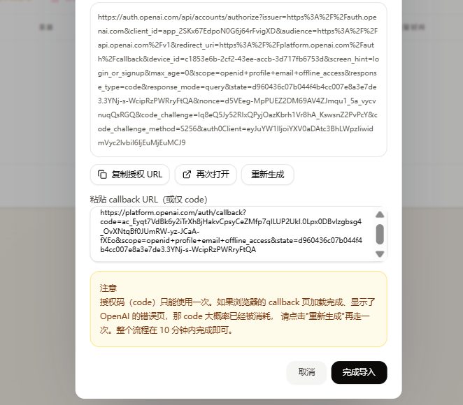

**9. 账号成功出现**

额度 5 张 image 2.5。

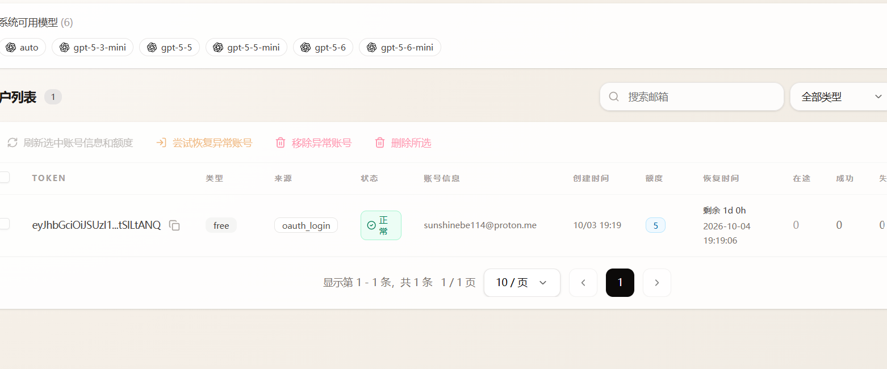

**10. API 地址**

后面加一个 `v1/images/generations`。

```bash
curl http://你的服务器IP:3000/v1/images/generations \
  -H "Content-Type: application/json" \
  -H "Authorization: Bearer chatgpt2api" \
  -d '{"model":"gpt-image-2","prompt":"一张极简产品海报","n":1}'
```

> 如果默认密钥没修改就是 `chatgpt2api`。